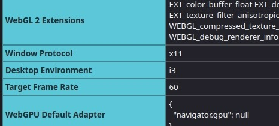

# swaywm-i3-youtube-fix

# Specs
*  **Hardware:** ThinkPad T450s
*  **OS:** Arch Linux x86_64
*  **Kernel:** Linux 6.15.2-arch1-1
*  **WM:** i3 and SwayWM
*  **Shell:** zsh 5.9

## The goal is to fix YouTube player after installing SwayWM when normally using i3wm ( X11 and Wayland conflict )  
   
When you have i3wm as your main WM and install SwayWM e.g. for testing purposes, you may break your youtube player functionality.  

i3wm runs on **X11** while SwayWM uses **Wayland**

My situation for example:  
*  I normally use i3wm but wanted to try SwayWM and after installing base packages and returning to i3wm, I couldn't play any videos on YouTube in Firefox

Firefox is in fact able to run on both **X11** and **Wayland** but there are some changes regarding **VA-API** depending on how it runs.

Remember that firefox uses **ffmpeg** for YouTube player so install it:
```zsh
sudo pacman -S ffmpeg
```

Also the drivers. For ThinkPad with Intel Graphics:
```zsh
sudo pacman -S intel-media-driver libva-utils
```   
And check like this:
```zsh
vainfo
```
Should return something like this in my case:
```zsh
Trying display: wayland
Trying display: x11
vainfo: VA-API version: 1.22 (libva 2.22.0)
vainfo: Driver version: Intel iHD driver for Intel(R) Gen Graphics - 25.2.3 ()
vainfo: Supported profile and entrypoints
      VAProfileNone                   :	VAEntrypointVideoProc
      VAProfileNone                   :	VAEntrypointStats
      VAProfileMPEG2Simple            :	VAEntrypointVLD
      VAProfileMPEG2Simple            :	VAEntrypointEncSlice
      VAProfileMPEG2Main              :	VAEntrypointVLD
      VAProfileMPEG2Main              :	VAEntrypointEncSlice
      VAProfileH264Main               :	VAEntrypointVLD
      VAProfileH264Main               :	VAEntrypointEncSlice
      VAProfileH264Main               :	VAEntrypointFEI
      VAProfileH264High               :	VAEntrypointVLD
      VAProfileH264High               :	VAEntrypointEncSlice
      VAProfileH264High               :	VAEntrypointFEI
      VAProfileVC1Simple              :	VAEntrypointVLD
      VAProfileVC1Main                :	VAEntrypointVLD
      VAProfileVC1Advanced            :	VAEntrypointVLD
      VAProfileJPEGBaseline           :	VAEntrypointVLD
      VAProfileH264ConstrainedBaseline:	VAEntrypointVLD
      VAProfileH264ConstrainedBaseline:	VAEntrypointEncSlice
      VAProfileH264ConstrainedBaseline:	VAEntrypointFEI
      VAProfileVP8Version0_3          :	VAEntrypointVLD
```
You will need to first check in what mode is Firefox running in.  
In the search bar type `about:support` and Enter.  
  
Check **informations about application** and look for **Window Protocol**  
* If you see **`x11`** or **`xwayland`** there:  
  Then this is **not the cause** of youtube player broken on your desktop  
* If you see **`wayland`**  
  Then this is the cause of broken youtube player  

My example:




Regardless of what mode was shown there, the quickest probable fix is running Firefox via terminal emulator with a specific argument:
```zsh
MOZ_ENABLE_WAYLAND=0 firefox
```

Then fully restart firefox and if it works then it's done.  

For me, nothing really seemed to work. Funny how on SwayWM session Youtube fully worked, but not on i3.  

Run
```zsh
sudo pacman -Syu
```
```zsh
sudo pacman -Rns pulseaudio
```
```zsh
sudo pacman -S pipewire-pulse
```

This fully fixed the issue of YouTube video player not playing anything. 
